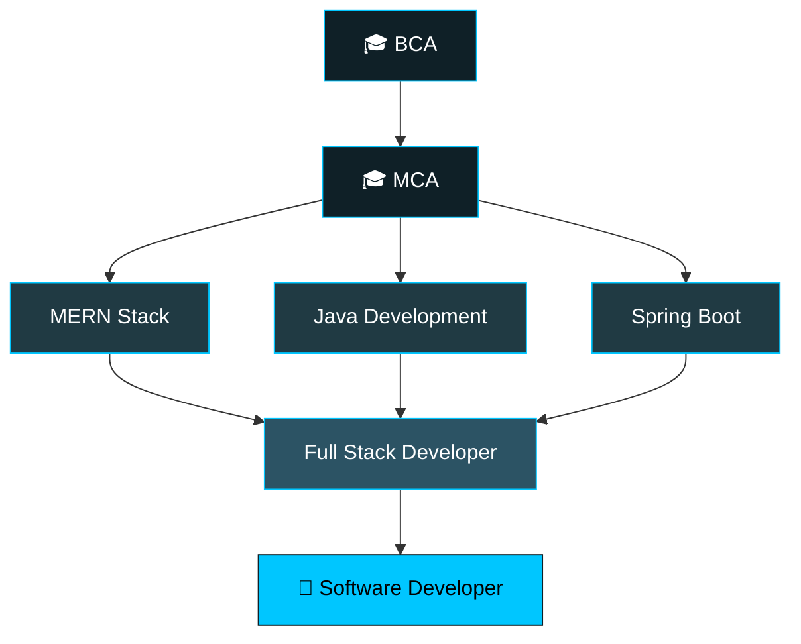

 

  

 

## 📊 Developer Hub

 

## 📈 Contributions

 

## 🔥 Consistency

 

## 🛠️ Tech Stack &nbsp;|&nbsp; 💻 Languages

<table width="100%">
<tr>
<td width="50%" valign="top">

</td>
<td width="50%" valign="top">

</td>
</tr>
</table>

 

## 🚀 Featured Work

<table width="100%">
<tr>
<td width="50%" valign="top">

### 🆘 The Saviour
**Community Disaster Response Platform**

`MERN` `Socket.IO` `JWT` `MongoDB`

</td>
<td width="50%" valign="top">

### ☕ Spring Boot Project
**Production-style REST API**

`Java` `Spring Boot` `Database`

</td>
</tr>
</table>

 

## 🧭 Developer Journey

 

## 🌱 Currently

| 🔨 Building | ☕ Learning | 🧠 Exploring | ☁️ Next |
|:---:|:---:|:---:|:---:|
| The Saviour | Spring Boot | System Design | Docker & Cloud |

 

## 🏆 Certifications

 

## 🤝 Let's Connect

